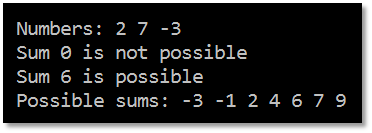

<!-- section start -->
<!-- attr: { class:'slide-title', showInPresentation:true, hasScriptWrapper:true, style:'' } -->
# Dynamic Programming
##  Brief Introduction in Problem Solving using Dynamic Programming and Memoization
<div class="signature">
    <p class="signature-course">Data Structures & Algorithms</p>
    <p class="signature-initiative">Telerik Software Academym</p>
    <a href="http://academy.telerik.co" class="signature-link">http://academy.telerik.co</a>
</div>


<!-- section start -->
<!-- attr: { showInPresentation:true, style:'' } -->
# Table of Contents
* Minimum and Maximum
* Divide-and-Conquer
* Dynamic ProgrammingConcepts
* Fibonacci Numbers
* Longest IncreasingSubsequence
* Longest CommonSubsequence


<!-- section start -->
<!-- attr: { class:'slide-section', showInPresentation:true, style:'' } -->
# Minimum and Maximum

<!-- attr: { showInPresentation:true, style:'' } -->
# Minimum and Maximum
* The `minimum `of a set of N elements
  * The first element in list of elements ordered in incremental order (index = 1)
* The `maximum `of a set of N elements
  * The last element in list of elements ordered in incremental order (index = N)
* The `median `is the "halfway point" of the set
  * When N is odd, index = (N+1) / 2 = unique value
  * When N is even, index = N/2 (lower median) or index = (N+2)/2  (upper median)

<!-- attr: { showInPresentation:true, style:'font-size:0.9em' } -->
# Finding Min and Max Element
* Minimum element

```cs
int FindMin(int[] arr)
{
    int min = arr[0];
    for (int i = 1; i < arr.Length; i++)
        if (arr[i] < min) min = arr[i];
    return min;
}
```

* Maximum element

```cs
int FindMax(int arr[])
{
    int max = arr[0];
    for (int i = 1; i < arr.Length; i++)
        if (arr[i] > max) max = arr[i];
    return max;
}
```

<!-- section start -->
<!-- attr: { class:'slide-section', showInPresentation:true, style:'' } -->
# Divide-and-Conquer

<!-- attr: { showInPresentation:true, style:'' } -->
# Divide-and-Conquer
* `Divide`: If the input size is too large to deal with in a straightforward manner
  * Divide the problem into two or more disjointed sub-problems
* `Conquer`: conquer recursively to solve the sub-problems
* `Combine`: Take the solutions to the sub-problems and "merge" these solutions into a solution for the original problem

<!-- attr: { showInPresentation:true, style:'' } -->
# Divide-and-Conquer Example
* MergeSort
  * The sub-problems are independent, all different

```cs
void MergeSort(int[] arr, int left, int right)
{
  if (right > left)
  {
    int mid = (right + left) / 2;
    MergeSort(arr, left, mid);
    MergeSort(arr, (mid+1), right);
    Merge(arr, left, (mid+1), right);
  }
}
```

<!-- attr: { showInPresentation:true, hasScriptWrapper:true, style:'' } -->
# Divide-and-Conquer Algorithms
* Binary search
  * Closest pair in 2D geometry
* Quick sort
* Merging arrays
  * Merge sort
* Finding majorant
* Tower of Hanoi
* Fast multiplication
  * Strassen’s Matrix Multiplication


<!-- section start -->
<!-- attr: { class:'slide-section', showInPresentation:true, style:'' } -->
# Dynamic Programming

<!-- attr: { showInPresentation:true, style:'' } -->
# Dynamic Programming
* How dynamic programming (DP) works?
  * Approach to solve problems
  * Store partial solutions of the smaller problems
  * Usually they are solved bottom-up
* Steps to designing a DP algorithm:
  * Characterize `optimal substructure`
  * `Recursively` define the value of an optimal solution
  * Compute the value `bottom up`
  * (if needed) `Construct` an optimal solution

<!-- attr: { showInPresentation:true, style:'' } -->
# Elements of DP
* DP has the following characteristics
  * Simple sub-problems
    * We break the original problem to smaller sub-problems that have the same structure
  * Optimal substructure of the problems 
    * The optimal solution to the problem contains within optimal solutions to its sub-problems
  * Overlapping sub-problems 
    * There exist some places where we solve the same sub-problem more than once

<!-- attr: { showInPresentation:true, style:'' } -->
# Common Characteristics
* The problem can be divided into `levels` with a `decision` required at each level
* Each level has a number of `states` associated with it
* The decision at one level transforms one state into a state in the next level
* Given the current state, the optimal decision for each of the remaining states does not depend on the previous states or decisions

<!-- attr: { showInPresentation:true, style:'' } -->
# Difference between DPand Divide-and-Conquer
* Using Divide-and-Conquer to solve problems (that can be solved using DP) is `inefficient`
  * Because the same common sub-problems have to be solved many times
* DP will solve each of them once and their answers are stored in a table for future use
  * Technique known as “memoization”

<!-- section start -->
<!-- attr: { class:'slide-section', showInPresentation:true, hasScriptWrapper:true, style:'' } -->
# Fibonacci Numbers
##  From "divide and conquer" to dynamic programming

<!-- attr: { showInPresentation:true, style:'' } -->
# Fibonacci sequence
* The Fibonacci numbers are the numbers in the following integer sequence:
  * 0, 1, 1, 2, 3, 5, 8, 13, 21, 34, 55, 89, 144, …
  * The first two numbers are 0 and 1
  * Each subsequent number is the sum of the previous two numbers
* In mathematical terms:
  * F<sub>n</sub> = F<sub>n-1</sub> + F<sub>n-2</sub>
  * F<sub>0</sub> = 0, F<sub>1</sub> = 1

<!-- attr: { showInPresentation:true, hasScriptWrapper:true, style:'font-size:0.9em' } -->
# Divide and Conquer Approach
* How can we find the n<sup>th</sup> Fibonacci number using recursion ("divide and conquer")
* Directly applying the recurrence formula

```cs
decimal Fibonacci(int n)
{
    if (n == 0) return 0;
    if (n == 1) return 1;
    return Fibonacci(n - 1) + Fibonacci(n - 2);
}
```

<!-- attr: { showInPresentation:true, style:'' } -->
# Fibonacci and Memoization
* We can save the results from each function call
* Every time when we call the function we check if the value is already calculated
* This saves a lot of useless calculations!
* http://en.wikipedia.org/wiki/Memoization

```cs
decimal Fibonacci(int n)
* {   if (memo[n] != 0) return memo[n];
   if (n == 0) return 0;
   if (n == 1) return 1;
*    memo[n] = Fibonacci(n - 1) + Fibonacci(n - 2);
   return memo[n];
}
```

<!-- attr: { showInPresentation:true, hasScriptWrapper:true, style:'font-size:0.9em' } -->
# Fibonacci and DP
* How to find the `nth` Fibonacci number using the dynamic programming approach?
  * We can start solving the Fibonacci problem from bottom-up calculating partial solutions
  * We know the answer for the `0th` and the `1st` number of the Fibonacci sequence


  * And we know the formula to calculate each of the next numbers (`Fi = Fi-1 + Fi-2`)

<!-- attr: { showInPresentation:true, hasScriptWrapper:true, style:'' } -->
# Compare Fibonacci Solutions
* Recurrent solution
  * Complexity: ~ O(1.6<sup>n</sup>)
* DP or memoization solution
  * Complexity: ~ O(n)
* Dynamic programming solutions is way faster than the recurrent solution
  * If we want to find the 36<sup>th</sup> Fibonacci number:
    * Recurrent solution takes ~48 315 633 steps
    * Dynamic programming solution takes ~36 steps

<!-- section start -->
<!-- attr: { class:'slide-section', showInPresentation:true, style:'' } -->
# Moving Problem

<!-- attr: { showInPresentation:true, hasScriptWrapper:true, style:'' } -->
# Moving Problem
* In many DP problems there is a moving object with some restrictions
* For example - in how many ways you can reach from topleft corner of a grid to thebottom right
* You can move only right and down
* Some cells are unreachable


<!-- section start -->
<!-- attr: { class:'slide-section', showInPresentation:true, hasScriptWrapper:true, style:'' } -->
# Subset Sum Problem

<!-- attr: { showInPresentation:true, hasScriptWrapper:true, style:'' } -->
# Subset Sum Problems
* Given a set of integers, is there a non-empty subset whose sum is zero?
* Given a set of integers and an integer S, does any non-empty subset sum to S?
* Given a set of integers,find all possible sums<!-- .element: style="width:60%" -->
* Can you equally separate the value of coins? <!-- .element: style="width:60%" -->


<!-- attr: { showInPresentation:true, style:'font-size:0.95em' } -->
# Subset Sum Problem
* Solving the subset sum problem:
  * numbers = { 3, 5, -1, 4, 2 }, sum = 6
  * start with possible = { 0 }
* Step 1: obtain all possible sums of { 3 }
  * possible = { 0 } ∪ { 0+3 } = { 0, 3 }
* Step 2: obtain all possible sums of { 3, 5 }
  * possible = { 0, 3 } ∪ { 0+5, 3+5 } = { 0, 3, 5, 8 } 
* Step 3: obtain all possible sums of { 3, 5, -1 }
  * possible = { 0, 3, 5, 8 } ∪ { 0-1, 3-1, 5-1, 8-1 } ={ -1, 0, 2, 3, 4, 5, 7, 8 }
* …

<!-- attr: { showInPresentation:true, style:'font-size:0.9em' } -->
# Subset Sum Problem - C++

```cpp
for(int i = 0; i < N; i++)
{
   int newminpos = minpos, newmaxpos = maxpos;
   int newpossible[OFFSET + OFFSET] = { 0 };
   for(int j = maxpos; j >= minpos; j--) // j = one possible sum
   {
      if (possible[j+OFFSET]) newpossible[j+nums[i]+OFFSET] = 1;
      if (j+nums[i] > newmaxpos) newmaxpos = j+nums[i];
      if (j+nums[i] < newminpos) newminpos = j+nums[i];
   }
   minpos = newminpos;
   maxpos = newmaxpos;
   for(int j = maxpos; j >= minpos; j--)
      if (newpossible[j+OFFSET] == 1)
         possible[j+OFFSET] = 1;
   if (nums[i] > maxpos) maxpos = nums[i];
   if (nums[i] < minpos) minpos = nums[i];
   possible[nums[i]+OFFSET] = 1;
}
```

<!-- attr: { showInPresentation:true, hasScriptWrapper:true, style:'font-size:0.9em' } -->
# Subset Sum Problem – Answer

```cpp
int S = 5;
if (possible[0+OFFSET]) cout << "Sum 0 is possible" << endl;
else cout << "Sum 0 is not possible" << endl;
if (possible[S+OFFSET]) cout << "Sum " << S << " is possible" <<
 endl;
else cout << "Sum " << S << " is not possible" << endl;
cout << "Possible sums:";
for(int i = minpos; i <= maxpos; i++)
{
    if (possible[i+OFFSET] == 1) cout << " " << i;
}
```




<!-- section start -->
<!-- attr: { class:'slide-section', showInPresentation:true, hasScriptWrapper:true, style:'' } -->
# Longest Increasing Subsequence

<!-- attr: { showInPresentation:true, style:'font-size:0.9em' } -->
# Longest Increasing Subsequence
* Find a subsequence of a given sequence in which the subsequence elements are in sorted order, lowest to highest, and in which the subsequence is as long as possible
* This subsequence is not necessarily contiguous, or unique
* The longest increasing subsequence problem is solvable in time O(n log n)
* We will review one simple DP algorithm with complexity O(n * n)

<!-- attr: { showInPresentation:true, hasScriptWrapper:true, style:'' } -->
# LIS – C++ Solution

```cpp
L[0] = 1; P[0] = -1;for (int i = 1; i < N; i++)
{
    L[i] = 1;
    P[i] = -1;
    for (int j = i - 1; j >= 0; j--)
    {
        if (L[j] + 1 > L[i] && S[j] < S[i])
        {
            L[i] = L[j] + 1;
            P[i] = j;
        }
    }
    if (L[i] > maxLength)
    {
        bestEnd = i;
        maxLength = L[i];
    }
}
```


<!-- attr: { showInPresentation:true, hasScriptWrapper:true, style:'' } -->
# LIS – Restore the Sequence

```cpp
cout << "Max length: " << maxLength << endl;
cout << "Sequence end index: " << bestEnd << endl;
cout << "Longest subsequence:";
int ind = bestEnd;
while(ind != -1)
{
    cout << " " << S[ind];
    ind = P[ind];
}
cout << endl;
```


<!-- section start -->
<!-- attr: { class:'slide-section', showInPresentation:true, style:'' } -->
# Longest Common Subsequence 
##  Recursive and DP Approach

<!-- attr: { showInPresentation:true, hasScriptWrapper:true, style:'' } -->
# Longest Common Subsequence
* Given two sequences `x[1..m]` and `y[1..n]`, find `a` longest common subsequence (LCS) to them both
* For example if we have `x="ABCBDAB"` and `y="BDCABA"` their longest common subsequence will be `"BCBA"`


<!-- attr: { showInPresentation:true, hasScriptWrapper:true, style:'' } -->
# LCS – Recursive Approach
* S<sub>1</sub> = GCCCTAGCG, S<sub>2</sub> = GCGCAATG 
  * Let C<sub>1</sub> = the right-most character of S<sub>1</sub>
  * Let C<sub>2</sub> = the right-most character of S<sub>2</sub>
  * Let S<sub>1</sub>' = S<sub>1</sub> with C<sub>1</sub> "chopped-off"
  * Let S<sub>2</sub>' = S<sub>2</sub> with C<sub>2</sub> "chopped-off"
* There are three recursive subproblems:
  * L<sub>1</sub> = LCS(S<sub>1</sub>', S<sub>2</sub>) 
  * L<sub>2</sub> = LCS(S<sub>1</sub>, S<sub>2</sub>') 
  * L<sub>3</sub> = LCS(S<sub>1</sub>', S<sub>2</sub>')

<!-- attr: { showInPresentation:true, hasScriptWrapper:true, style:'' } -->
<!-- # LCS – Recursive Approach -->
* The solution to the original problem is whichever of these is the longest:
  * L<sub>1</sub>
  * L<sub>2</sub>
  * If C<sub>1</sub> is not equal to C<sub>2</sub>, then L<sub>3</sub>
  * If C<sub>1</sub> equals C<sub>2</sub>, then L<sub>3</sub> appended with C<sub>1</sub>
* This recursive solution requires multiple computations of the same sub-problems
* This recursive solution can be replaced with DP

<!-- attr: { showInPresentation:true, hasScriptWrapper:true, style:'' } -->
# Initial LCS table
* To compute the LCS efficiently using dynamic programming we start by constructing a table in which we build up partial results


<!-- attr: { showInPresentation:true, hasScriptWrapper:true, style:'' } -->
<!-- # Initial LCS table -->
* We'll fill up the table from top to bottom, and from left to right
* Each cell = the length of an LCS of the two string prefixes up to that row and column
* Each cell will contain a solution to a sub-problem of theoriginal problem <!-- .element: style="width:60%" -->
  * S<sub>1</sub> = GCCCTAGCG
  * S<sub>2</sub> = GCGCAATG


<!-- attr: { showInPresentation:true, hasScriptWrapper:true, style:'' } -->
# LCS table – base cases filled in
* Each empty string has nothing in common with any other string, therefor the 0-length strings will have values 0 in the LCS table

```cs
for (i=0; i<=n; i++){
    c[i][0] = 0;}
```

```cs
for (i=0; i<=m; i++){
    c[0][i] = 0;}
```


<!-- attr: { showInPresentation:true, hasScriptWrapper:true, style:'' } -->
# LCS – C++ Code Solution

```cpp
int LCS(string X, string Y) {
    int m = X.length();
    int n = Y.length();
    for (int i = 1; i <= m; i++)
    {
        for (int j = 1; j <= n; j++)
        {
            if (X[i-1] == Y[j-1])
            {
                c[i][j] = c[i-1][j-1] + 1;
            }
            else            {
                c[i][j] = max(c[i][j-1], c[i-1][j]);
            }
        }
    }
    return c[m][n];
}
```


<!-- attr: { showInPresentation:true, hasScriptWrapper:true, style:'' } -->
# LCS – Reconstruct the Answer

```cpp
void printLCS(int i,int j)
{
    if (i==0 || j==0) return;
    if (X[i-1] == Y[j-1])
    {
       printLCS(i-1, j-1);
       cout << X[i-1];
    }
    else if (c[i][j] == c[i-1][j])
    {
        printLCS(i-1, j);
    }
    else
    {
        printLCS(i, j-1);
    }
}
```


<!-- attr: { showInPresentation:true, hasScriptWrapper:true, style:'' } -->
# DP Applications
* Areas
  * Bioinformatics
  * Control theory
  * Information theory
  * Operations research
  * Computer science: 
    * Theory
    * Graphics
    * AI

<!-- attr: { showInPresentation:true, style:'' } -->
# Some Famous Dynamic Programming Algorithms
* Integer Knapsack Problem
* Unix diff for comparing two files
* Bellman–Ford algorithm for finding the shortest distance in a graph
* Floyd's All-Pairs shortest path algorithm
* Cocke-Kasami-Younger for parsing context free grammars
* [en.wikipedia.org/wiki/Dynamic_programming](http://en.wikipedia.org/wiki/Dynamic_programming)


<!-- section start -->
<!-- attr: { showInPresentation:true, style:'font-size:0.95em' } -->
# Summary
* Divide-and-conquer method for algorithm design
* Dynamic programming is a way of improving on inefficient divide-and-conquer algorithms
* Dynamic programming is applicable when the sub-problems are dependent, that is, when sub-problems share sub-sub-problem
* Recurrent functions can be solved efficiently
* Longest increasing subsequence and Longest common subsequence problems can be solved efficiently using dynamic programming approach


<!-- section start -->
<!-- attr: { id:'questions', class:'slide-section', showInPresentation:true, style:'' } -->
# Questions
## Dynamic Programming
[link to Telerik Academy Forum](http://telerikacademy.com/Forum/Category/15/data-structures-algorithms)
